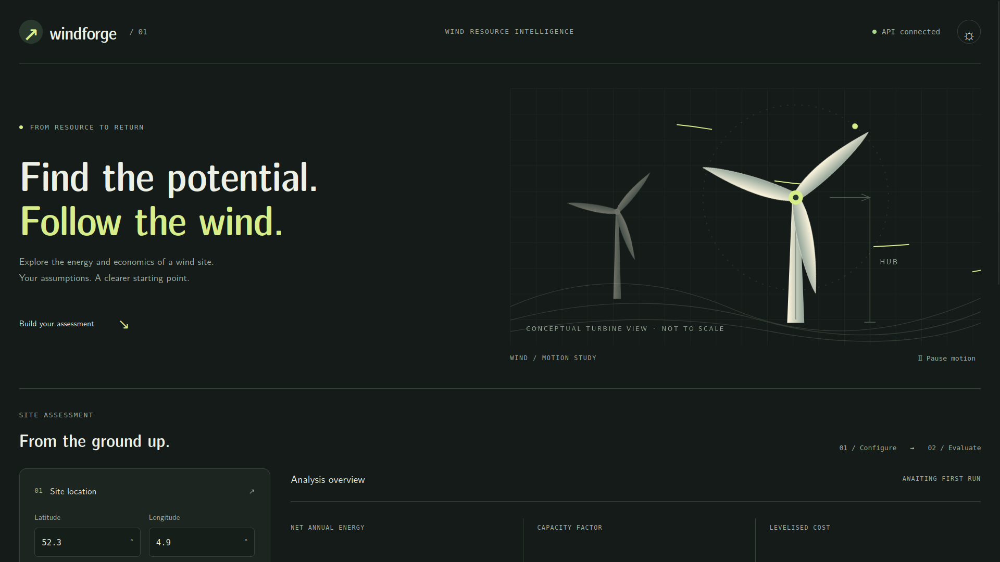
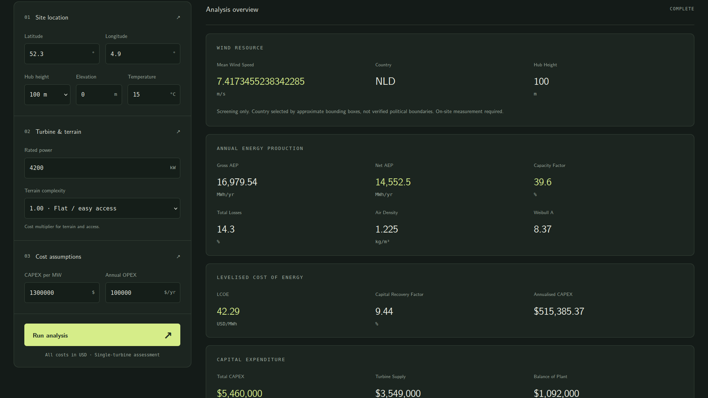
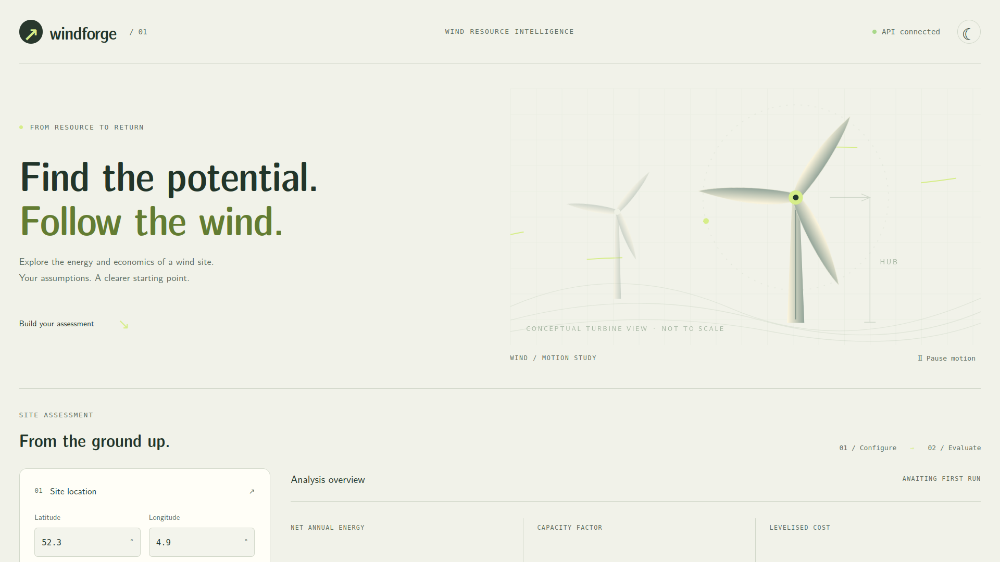

# WindForge

**Wind resource, energy yield and project economics in one assessment.**

WindForge is a wind-site screening demo that connects geographic wind data to turbine output and cost assumptions. Enter a location, configure a turbine and explore how wind conditions, losses and capital costs affect estimated annual generation and levelised cost of energy.

[Explore the code](https://github.com/neo-t-maredi/windforge) · [Backend tests](backend/tests) · [Model notes and validation](backend/TESTING.md)



## Why this project

A wind-speed number alone cannot explain a project's energy yield or economics. WindForge brings the calculation steps into one interface: resource sampling, a turbine power model, site air density, energy losses, installation costs and annual operating costs.

The project focuses on making those assumptions inspectable and testing the connections between them. It is a working engineering demonstration, not a bankable feasibility study.

## What it does

- Samples mean wind speed from Global Wind Atlas country rasters at supported hub heights of 50, 100 and 200 metres.
- Estimates gross and net annual energy production using a synthetic turbine curve and an assumed Weibull distribution.
- Applies site air-density correction and multiplicative energy losses.
- Estimates CAPEX, cost breakdown, capacity factor and CRF-based LCOE.
- Presents a heuristic feasibility score with explicitly unverified jurisdiction context.
- Provides dark/light themes, animated SVG turbines, motion controls and a responsive assessment form.

## A completed assessment



This local run used coordinates **52.3, 4.9**, a **100 m** hub height and a **4.2 MW** turbine. Cost assumptions were **$1.3 million/MW** CAPEX and **$100,000/year** OPEX, with flat terrain, 0 m elevation and 15°C temperature.

| Output | Displayed result |
| --- | ---: |
| Mean wind speed | 7.42 m/s |
| Net annual energy | 14,552.5 MWh/year |
| Capacity factor | 39.6% |
| Total CAPEX | $5.46 million |
| LCOE | $42.29/MWh |
| Heuristic screening score | 70/100 — Moderate |

These are model outputs from a demonstration run, not measured turbine production or a verified project's financial performance. Financial defaults are a 7% discount rate and 20-year lifetime.

<details>
<summary>View the light theme</summary>



</details>

## Stack and calculation flow

| Layer | Implementation |
| --- | --- |
| Interface | React, Vite, CSS and animated SVG |
| API | Python, FastAPI and HTTPX |
| Resource sampling | Rasterio with CRS conversion and pixel validation |
| Calculations | SciPy integration, Weibull distribution and explicit cost assumptions |
| Tests | pytest, FastAPI TestClient, HTTPX MockTransport and temporary GeoTIFF fixtures |

The frontend requests resource, AEP, LCOE, CAPEX and feasibility results from five endpoints. The backend downloads and caches the relevant raster, samples the site's wind speed and applies the calculation model. Tests check that shared assumptions produce consistent energy and cost values across endpoints.

## Run locally

Use **Python 3.12** and **Node.js 24**. The backend needs internet access for an uncached Global Wind Atlas download. Country rasters can take longer to download on the first run.

Clone the repository:

```bash
git clone https://github.com/neo-t-maredi/windforge.git
cd windforge
```

Start the backend in one terminal:

```bash
cd backend
python3 -m venv .venv
source .venv/bin/activate
python -m pip install -r requirements-dev.txt
python -m uvicorn app.main:app --reload --port 8000
```

In a second terminal, from the repository root:

```bash
cd frontend
npm install
npm run dev
```

Open **http://localhost:5173**. API documentation is available at **http://127.0.0.1:8000/docs**. The frontend's “API connected” status confirms backend health; a completed analysis separately confirms the resource/calculation workflow.

The frontend defaults to `http://127.0.0.1:8000`. Override it with `VITE_API_BASE_URL` in `frontend/.env` and restart Vite. Backend configuration is documented in [`backend/.env.example`](backend/.env.example). Default CORS origins are `localhost:5173` and `127.0.0.1:5173`.

## Tests and checks

From `backend`, with the virtual environment active:

```bash
python -m pytest --cov=app --cov-branch --cov-report=term-missing
```

**Recorded validation: 115 tests passed, with 97% coverage including branches.** This was measured on the reviewed backend using Python 3.12.14; it is not a live CI badge.

Tests cover calculation boundaries, units, zero-interest LCOE, validation errors, endpoint consistency, rate limiting, CORS, projected rasters, nodata, download failures and cache behaviour. An integration test exercises routing, raster decoding and calculations while replacing only the external HTTP download with a deterministic fixture.

From `frontend`:

```bash
npm run lint
npm run build
```

See [`backend/TESTING.md`](backend/TESTING.md) for the fixes, test scope and outstanding limitations.

## Model boundaries

- Country selection uses approximate Netherlands and Saudi Arabia bounding boxes, not verified borders. Locations elsewhere are unsupported; neighbouring territory inside a box can be misclassified.
- Weibull shape is fixed at **k = 2**. The turbine power curve is synthetic and has not been calibrated to an OEM turbine.
- Default losses are 8% wake, 3% availability, 2% electrical and 2% environmental, applied multiplicatively. The wake assumption needs particular care for a single-turbine scenario.
- Costs and score thresholds are screening assumptions. Jurisdiction text is unverified demo context and may be stale.
- Passing tests establishes software behaviour, not engineering certification or investment suitability. Site measurements, OEM curves and project-specific costs are needed for a defensible feasibility study.

## Author and licence

Built by [Neo Maredi](https://github.com/neo-t-maredi).

Project code: [MIT licence](LICENSE). Bundled fonts have their own [licence notices](frontend/src/assets/fonts/LICENSE.txt). Wind-resource data is provided by [Global Wind Atlas](https://globalwindatlas.info/); consult the provider's terms when using or redistributing its data.
